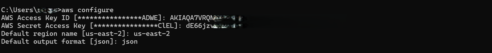
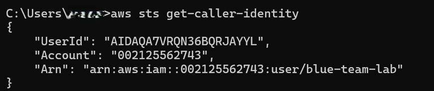

# ⚙️ AWS CLI Lab – Verifying Blue-Lab-User Access

## 🎯 Objective

Use the AWS Command Line Interface (CLI) to authenticate with `blue-lab-user`, validate permissions, and prepare for detection-based workflows.

---
## 1️⃣ Pre-requisites

AWS Free Tier account
IAM user (blue-lab-user) with ReadOnlyAccess
Access keys generated and saved securely
AWS CLI installed

## 2️⃣ Configure AWS CLI

Run the following command:

```bash
aws configure
```
Enter the details from the access key created earlier:
AWS Access Key ID
AWS Secret Access Key
Region: us-east-2 (or your preferred region)
Output format: json

*Screenshot: Inputs presented to the aws config command*

## 3️⃣ Validate Access

Run the following command

```bash
aws sts get-caller-identity
```
Expected Output:
ARN of the IAM user
Account ID
User ID


*Screenshot: Validated access related information*

✅ Outcome
blue-lab-user is now configured locally with CLI access. This user will be used to safely interact with AWS services like:
GuardDuty alerts
CloudTrail logs
VPC Flow Logs
IAM policy evaluation
S3 bucket visibility

🔒 Notes
CLI access uses programmatic credentials, not your root account — best practice ✅
Keep .aws/credentials file secured (stored in your home directory)
No destructive actions can be taken due to ReadOnly permissions


