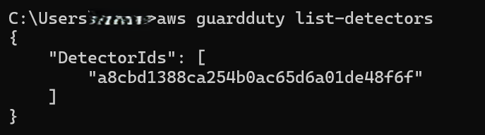
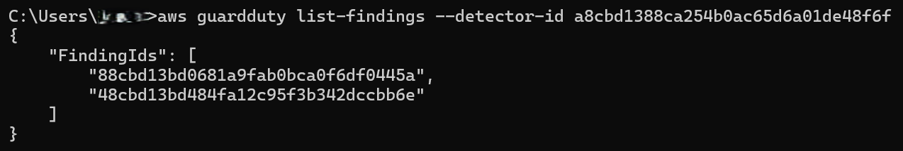
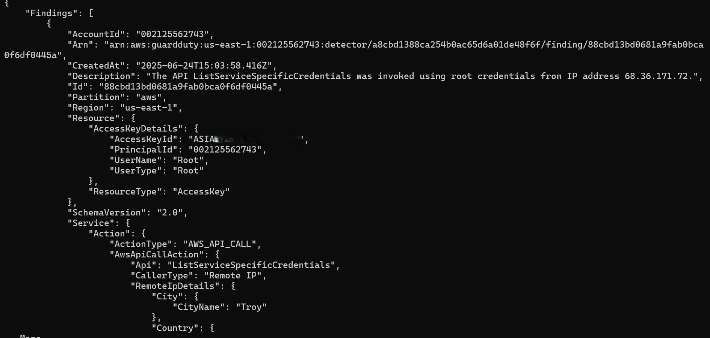

## 🛡️ GuardDuty CLI Detection Workflow

### 🔍 Step 1: List Detectors
```bash
aws guardduty list-detectors
```

*Screenshot: List of detectors*

### 🔍 Step 2: List Findings

```bash
aws guardduty list-findings --detector-id <your-id>
```

*Screenshot: List of Findings*

### 🔍 Step 2: Get Findings

```bash
aws guardduty get-findings --detector-id <your-id> --finding-ids <id>
```

*Screenshot: Detailed CLI Findings*

## 🧪 Finding Analysis via AWS CLI

We retrieved detailed GuardDuty findings using the CLI:

- **Finding Type**: Policy:IAMUser/RootCredentialUsage
- **Severity**: 2.0 (Low)
- **Action**: The API ListServiceSpecificCredentials was invoked using root credentials.
- **Source IP**: 68.36.171.72 Troy United States

## Description  
The API DescribeMalwareScans was invoked using root credentials from IP address 68.36.171.72 Troy United States. Guard duty triggered the alert since root credentials were used. This could pose a threat if the activity was unauthorized.


## Implications  
Use of root credentials for API calls is generally discouraged as it carries high privilege. Although this finding is low severity, it indicates potential risk of misuse or compromise of root credentials, which could lead to unauthorized access or privilege escalation.

## Recommended Response  
1. Verify if this API call was initiated by an authorized administrator.  
2. Rotate root account access keys immediately if the activity is suspicious or unauthorized.  
3. Implement multi-factor authentication (MFA) on the root account to reduce risk.  
4. Monitor further root credential usage and consider restricting root API access via IAM policies.


*Screenshot: Detailed CLI Findings*


